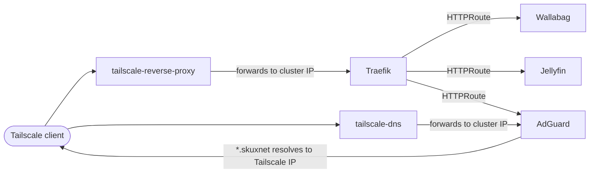

# skuxnet Kubernetes Cluster

Single-node Talos cluster managed with Flux GitOps.

## Cluster overview

### What runs here

| Component | Namespace | Role |
|-----------|-----------|------|
| Traefik | `traefik` | Ingress controller (Gateway API) |
| Longhorn | `longhorn-system` | Distributed block storage with encryption |
| VolSync | `volsync-system` | PVC backup and restore via restic |
| Tailscale | `tailscale` | VPN ingress and DNS proxy |
| AdGuard Home | `adguard` | DNS server for `*.skuxnet`, ad-blocking |
| Wallabag | `wallabag` | Read-it-later app |
| Jellyfin | `jellyfin` | Media server |

### Network topology



Traffic flow: Tailscale clients resolve `*.skuxnet` via AdGuard, which points to the Tailscale reverse-proxy node's IP. That node forwards traffic to the Traefik service, which routes to the appropriate app via Gateway API HTTPRoutes.

### Storage strategy

All PVCs use Longhorn with the `longhorn-crypto-global` StorageClass, which encrypts volumes at rest using a global key stored in the `longhorn-crypto` secret in `longhorn-system`.

Wallabag's two PVCs (`wallabag-claim-data`, `wallabag-claim-images`) are backed up weekly (Sundays at 3am) via VolSync restic to S3-compatible storage. Jellyfin PVCs are not backed up — media can be re-added if lost.

---

## Prerequisites

Tools required locally:

- [`flux`](https://fluxcd.io/flux/installation/) — GitOps operator CLI
- [`kubectl`](https://kubernetes.io/docs/tasks/tools/) — Kubernetes CLI
- [`age`](https://github.com/FiloSottile/age) — key generation
- [`sops`](https://github.com/getsops/sops) — secret encryption/decryption

You also need:

- The **age private key** for the cluster (recipient `age15zhjt0ckkpckkk4f8wy3glh9cahdd68v3mr73p32z8mga7s3e5usx2sn6m`). Keep this somewhere safe outside the repo.
- A **GitHub fine-grained personal access token** scoped to this repository with the following permissions:
  - Administration → Access: Read-only
  - Contents → Access: Read and write
  - Metadata → Access: Read-only

---

## Fresh bootstrap

1. **Store the age private key in the cluster:**
   ```bash
   kubectl create namespace flux-system
   kubectl create secret generic sops-age \
     -n flux-system \
     --from-file=age.agekey=<path-to-age-private-key>
   ```

2. **Run Flux bootstrap:**
   ```bash
   flux bootstrap github \
     --owner=sidrubs \
     --repository=home \
     --branch=main \
     --path=clusters/skuxnet \
     --personal
   ```
   This creates `clusters/skuxnet/flux-system/` and commits it to the repo. Flux then begins reconciling.

3. **Wait for CRDs and infrastructure to reconcile:**
   ```bash
   flux get kustomizations --watch
   ```
   Wait until `crds` and `infrastructure` both show `Applied revision`.

4. **Trigger VolSync restore for Wallabag:**
   ```bash
   kubectl annotate replicationdestination wallabag-restore-data \
     -n wallabag volsync.backube/trigger-immediate=true
   kubectl annotate replicationdestination wallabag-restore-images \
     -n wallabag volsync.backube/trigger-immediate=true

   # Wait for both to complete
   kubectl wait replicationdestination wallabag-restore-data \
     -n wallabag --for=condition=Synchronizing=False --timeout=10m
   kubectl wait replicationdestination wallabag-restore-images \
     -n wallabag --for=condition=Synchronizing=False --timeout=10m
   ```

5. **Apps reconcile automatically** once the `apps` Kustomization is healthy. Wallabag will start with its restored data; Jellyfin gets fresh empty PVCs.

---

## Ongoing operations

### Check reconciliation status

```bash
# All Flux Kustomizations
flux get kustomizations

# All HelmReleases across namespaces
flux get helmreleases -A

# All pods
kubectl get pods -A
```

### Force a reconcile

```bash
# Reconcile a specific Kustomization
flux reconcile kustomization apps

# Reconcile a specific HelmRelease
flux reconcile helmrelease traefik -n traefik
```

### Wallabag backups

VolSync runs restic backups automatically on the schedule in `volsync-backup-data.yaml` and `volsync-backup-images.yaml` (Sundays at 3am). Check backup status with:

```bash
kubectl get replicationsource -n wallabag
```

---

## Secret management

Secrets are encrypted with [SOPS](https://github.com/getsops/sops) using the age key above. The `.sops.yaml` at the repo root configures encryption for any file under `**/secrets/**`.

### Decrypt and edit an existing secret

```bash
sops kubernetes/apps/wallabag/secrets/wallabag-secret.yaml
```

SOPS decrypts the file into your editor. Save to re-encrypt automatically.

### Encrypt a new secret

```bash
# Create the plaintext file first, then:
sops -e -i kubernetes/apps/wallabag/secrets/my-new-secret.yaml
```

### Important

**Never commit the age private key to this repository.** It should only ever exist in the `sops-age` secret in `flux-system` on the cluster, and in your own secure storage (password manager, etc.).
